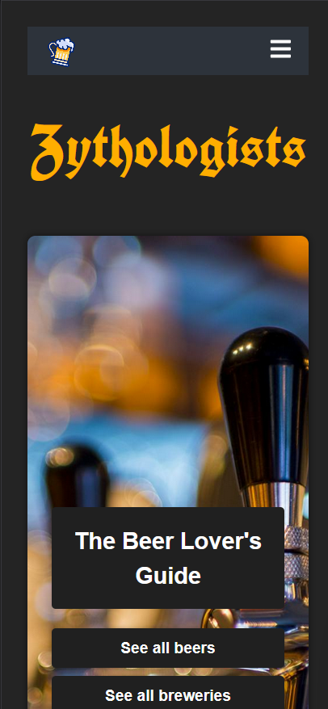

Le projet Zythologists est une application complète permettant de découvrir et gérer un catalogue de bières et brasseries. Il est composé de deux parties principales :

Un backend Node.js avec une API REST connectée à PostgreSQL (déployée sur Neon).

Un frontend React permettant d'afficher et d'interagir avec les données (déployé sur Vercel).

### Zythologists Frontend 🍺

Ce projet est l'interface utilisateur de l'application Zythologists, permettant d'afficher et gérer les bières, les brasseries et les avis des utilisateurs. L'application est construite avec React, et interagit avec une API REST déployée sur Neon.

## 🚀 Fonctionnalités

- Affichage des bières et des brasseries avec leurs détails.

- Recherche de bières et brasseries.

- Ajout, modification et suppression de brasseries sur l'éspace Administrateur.

## 🛠️ Technologies utilisées

React + TypeScript pour l'interface utilisateur.

React Router : Gestion de la navigation entre les pages.

Vercel : Déploiement de l'application frontend.

📂 Structure du projet

/src : Contient le code source du projet.

/pages : Composants des différentes pages (bières, brasseries, admin, etc.).

/components : Composants réutilisables (Navbar, Collapse, etc.).

/utils : Fetches pour interagir avec l'API backend.

## ⚙️ Installation et configuration

Prérequis

Node.js installé

Un backend opérationnel (API disponible sur Neon)

## 🚶‍➡️ Étapes
Cloner le dépôt :
git clone https://github.com/senga200/zitho-AC.git

Installer les dépendances :
npm install

Créer un fichier .env à la racine du projet :
VITE_API_BASE_URL=https://zythologueapi-ac.onrender.com/api/v1/beers
ou https://zythologueapi-ac.onrender.com/api/v1/breweries

Lancer l'application :
npm run dev

L'interface sera accessible sur http://localhost:5173

## 🌍 Déploiement

Le frontend est déployé sur Vercel.

URL de l'application : https://zitho-f7lr60daw-senga200s-projects.vercel.app/

🔗 API Backend

Ce projet consomme l'API backend disponible ici : 
https://zythologueapi-ac.onrender.com/api/v1/beers
https://zythologueapi-ac.onrender.com/api/v1/breweries

Le swagger est disponible pour tester les requêtes : https://zythologueapi-ac.onrender.com/api-docs

## 🎨 Aperçu

